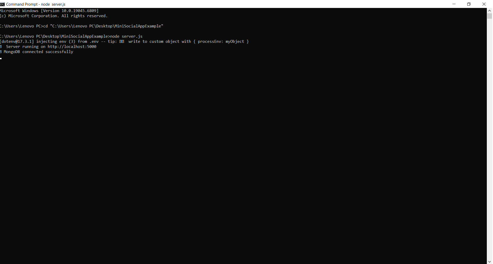
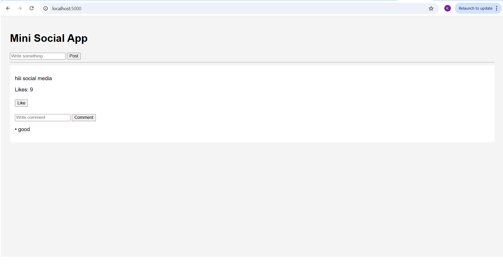
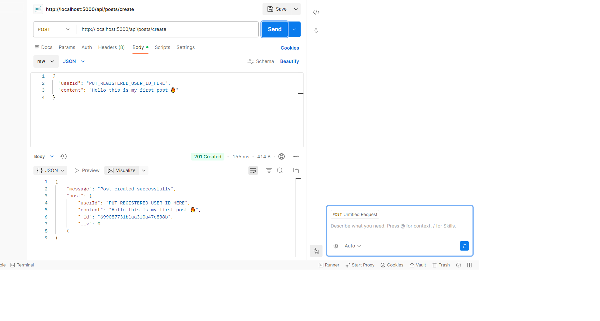
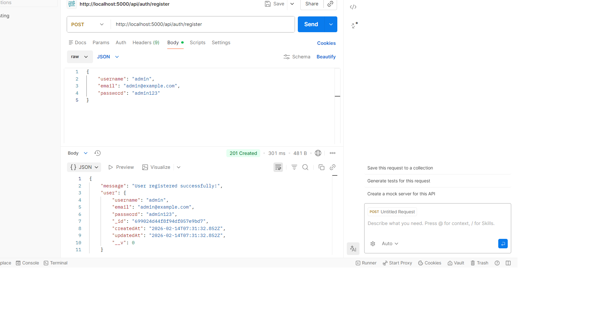
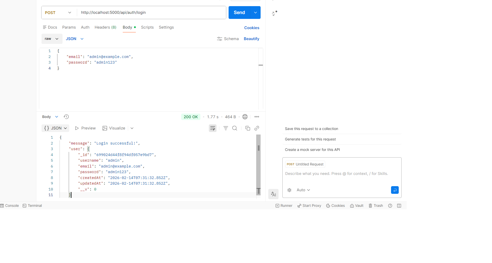
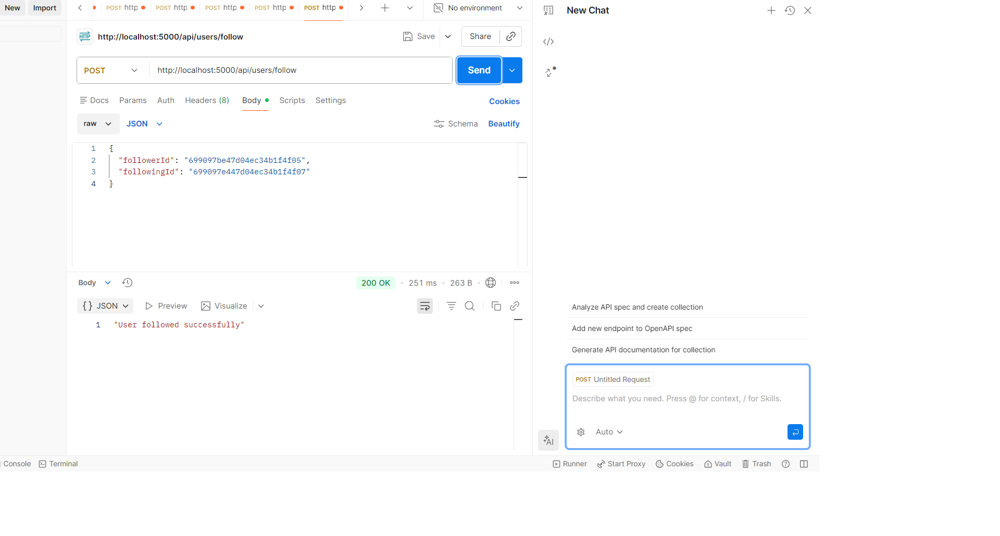

# 📱 CodeAlpha_SocialMediaPlatform

> **Frontend & Backend Included** – Full Stack Social Media Platform built using Node.js, Express.js, MongoDB, and EJS

## 📌 Task: Social Media Platform CodeAlpha Internship Task-2

### 📖 Description
A Full Stack Social Media Web Application developed using **Node.js, Express.js, MongoDB, and EJS**.  

The application allows users to:
- Register and login securely  
- Create, edit, and delete posts  
- View a feed of all posts  
- Like and comment on posts  
- Manage user profiles  

Built with **Node.js + Express.js + MongoDB + EJS (HTML, CSS, JavaScript)**.

## 👩‍🎓 Intern Details

**Name:** KANDEPU DHANA LAKSHMI  
**Student Id:** CA/DF1/23633  
**Internship Domain:** Full Stack Web Development  
**Organization:** Code Alpha  
**Project Name:** Social Media Platform  

## 🚀 Features

- User Authentication  
- Post Management (Create/Edit/Delete)  
- Feed Display  
- Likes & Comments  
- Profile Management  
- MongoDB Integration  
- RESTful Routing & MVC Architecture  

## 📸 Project Screenshots

### 1. Server Running

### 2. Like and comment demo

### 3. Post Created Successfully

### 4. User Registration Success

### 5. User Test Data

### 6. User Follow Success

---

Conclusion:
✅ This project demonstrates a complete end-to-end Full Stack Social Media Platform with Frontend & Backend integration, ready for real-world usage and further enhancements.

